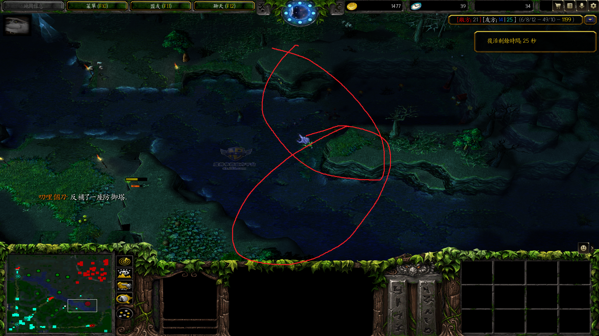
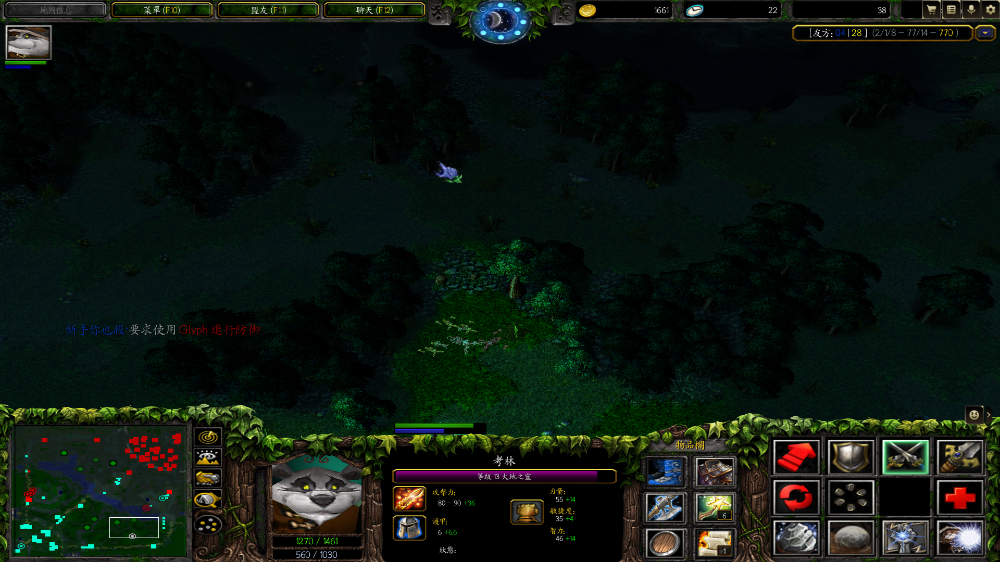

# EARTH SPIRIT 

大地之灵	考林	国足	石头猫	土猫	兔毛	猫猫	Earth Spirit	开图的叫 “图猫”

Dota1 土猫也经常被人误称做 “火猫”

---

#### 巨石冲击

Dota1 对付炸弹人，推上面的野怪下去排雷

在剑圣无敌斩瞬间推开剑圣

Dota1 出绿鞋走得快，更易实现滚到人后推人。Dota1 滚时减速，而且只能在敌人身后推。

推开齐天大圣在他大招时，可以先用推推，再根据推推推的方向再用 `巨石冲击` 推齐天大圣

推适用场景：推走想要肉身封野的敌人。最好是敌人在野区边缘，如果在正中心，那么最后把敌人推出去自己反倒封了野。

#### 巨石翻滚

Dota2 大地之灵 滚 遇到 BKB 单位也会停下。

Dota2 大地之灵 滚 遇到吹风不会停止。因此，当敌人追击你时，除了选择推走敌人再滚，还可以在滚前或滚后吹风敌人以清除阻碍。

Dota1 滚+shift攻击无法实现（官方平台中路可杀鸡版本）

Dota1 有时候一下A不死小鸡。所以最好让防御塔先A一下，再去杀鸡

DOTA2 不能从小鱼人跳中滚走。DotA1 可以。

Dota1 土猫在船长x快结束的时候滚，可以躲x；Dota2 船长可直接拉回正在滚的土猫。类似的还有凤凰，在Dota1中，凤凰飞可以躲船长x，但在DOTA2中，船长可直接拉回来。但是，在 7.34 版本，大地之灵 `巨石翻滚` 期间无敌，又和 DotA1 一样了。

7.34 在滚后用推推推自己可以改变滚的起点？克星变救星？经测试，确实可以改变滚的起点。推推不再打断土猫滚。同时，我测试了光法的致盲之光，也有同样的效果。

DOTA2 7.34 版本 大地之灵加强，**在滚动时无法成为目标，并且无敌**。在施法延迟期间英雄不是无敌。这意味着大地之灵不再能被光法 `致盲之光` 或推推打断 `巨石翻滚` 。只有在刚刚开始滚的时候 `致盲之光` 可以打断，推推不能打断 `巨石翻滚` 。在无敌期间可以使用物品、技能，但注意，当物品目标（如治疗药膏）指向自己时，双击无法使用，点击自身头像会提示 `目标无敌` ，无法使用。但是，由于在施法延迟期间，不是无敌的，反而可以使用治疗药膏等指向自己的物品。像风暴之灵 `球形闪电` 期间也是如此。

昆卡 `X标记` 仅在大地之灵 `巨石翻滚` 施法延迟期间(刚开始滚的时候) 能传回大地之灵，之后大地之灵便可通过 `巨石翻滚` 躲掉 `X标记` ，就像 Dota1 一样。但是，若滚完身上还有 `X标记`，则 `X标记` 依旧有效。这一点类似于 BKB 。

> 这里说一点：现在的减益免疫状态下（由于我经常玩米拉娜、莱恩），若受到眩晕，在减益免疫期间，不受到影响，但是负面作用还在；若减益免疫状态结束，且负面 buff 还在，则依旧会被眩晕。

中了血魔大后，不再需要畏惧了，直接滚走，因为无敌！

利用其无敌的特性，还可以躲 矮人直升机 `追踪导弹` 。不过注意要让导弹打到大地之灵，在大地之灵尚且无敌的时候。

`巨石翻滚` 现在可以滚进/出 `时空结界` ，但要注意，若撞到了虚空假面，则会停下了。所以救队友时，找好角度滚进去，不要撞到虚空假面或者其他敌方英雄。在测试的时候我发现了一个 BUG ，当我用 `巨石翻滚` 开始的一小段时间，被施加 `缠绕` 的状态，不能放 `残岩` ，这就导致滚不流畅。这是在斧王岛的测试，而在实战中显示技能在冷却中。在创建房间的地图是正常的。我打天梯显示 `冷却中` 。也许是我点了两下 `巨石翻滚` ？后来无意在fy直播间听到他也说土猫有个bug，有时候石头按不出来。

`巨石翻滚` 现在打断裂魂人 `暗影冲刺` 。

被 `缠绕` 时 (如 `阿托斯之棍` ) 、被 `束缚` 时 (如帕克 `梦境缠绕` ) 无法使用 `巨石翻滚` 。但是在被 `缠绕` 之前大地之灵使用出了 `巨石翻滚` ，那么大地之灵依旧可以滚走，若尚在 `缠绕` 时间范围内，则被 `缠绕` 。只有 `眩晕` 且在施法延迟期间才能打断大地之灵 `巨石翻滚` 。由此，我想研究一下其他带施法延迟的猫，如蓝猫等。

可以躲卡尔磁暴。

用大晕锤+增加施法距离道具来打断 BKB 谜团黑洞。大晕锤原始施法距离很短，很难成功打断谜团，但是稍微增加一点施法距离（100）就很容易打断黑洞。

#### 地磁之握

DOTA2 沉默不能打断风行大招

沉默不能打断深渊大招

#### 残岩

DOTA2 被沉默石头也不能释放。但 DotA1 被沉默可以放石头。

#### 磁化

能否驱散：可以驱散

`磁化` 如果一个单位受到 `巨石冲击` 或 `地磁之握` 的效果，那么被 `磁化` 的单位受到相同的效果。但要注意的是，不用石头使用 `巨石冲击` 例外，其他单位不受到影响。

`磁化` 到隐身单位有特效。

`磁化` 在娜迦海妖大招 `SONG OF THE SIREN` 期间即可开始计数，但敌人不受到伤害。

关于大地之灵的大招 `磁化` 我今天研究了以下，如何大到远处的敌人。首先要保证远处敌人600码内有残岩，先要大到近处的敌人，然后推被大到的敌人到残岩出引发残岩的爆炸，这将波及到600码内的敌人使他们也会受到磁化。

<video src="./img/2023-08-09 19-23-15.mkv"></video>
必须通过 `残岩` 来传播 `磁化` 。
<video src="./img/2023-08-09 19-22-36.mkv"></video>

#### 残岩魔咒

土猫A杖后，可将自己变为石头，朝向哪个方向，使用一技能，就飞向哪个方向

A杖石化自己可以动？BKB?

石化不能断TP?

可以石化凤凰蛋

DOTA2 滚、拉、推破坏树木。DOTA1 滚、推破坏树木，拉不破坏树木

https://www.bilibili.com/video/BV1XD4y1h7NQ 

11:20 蝙蝠二技能不打断滚，但造成位移。这时土猫在变成球状

13:48 蝙蝠二技能打断滚。这时土猫已经在滚

DOTA1推不打断TP，拉打断TP。DOTA2推、拉都不打断TP

*Dota1 如果自己特别肥，给队友买TP*

DOTA1	`滚 + shift推` 无法实现；
DOTA2	`滚 + shift推` 可以实现，因为 Dota2 大地之灵在滚的途中可以使用技能和物品。

DOTA2 土猫一、三技能没有视野

Dota1 被血魔放大最好先滚走，再晕，若推开，死亡概率会增大，推开意味着被沉默

Dota1 跟屠夫、海民对线，前期可考虑学推，推他们进塔。故前期没有杀鸡，技能留点

Dota1 真眼可看见开雾幽鬼，宙斯大开雾不能躲。

DOTA2 土猫在滚的同时可以右键移动或放石头（根据石头位置）来改变滚时的动作，但是不改变方向

- [x] 小鱼人束缚下，推小鱼人？
- [x] 推队友？

打剑圣，剑圣转队友，推队友可以救他

*玩土猫必须注意的一件事，释放石头会解除 h 的状态，这样很容易导致 `巨石冲击` 释放不成功*

不会滚到吹风单位，逃生时可根据这一特性滚之前或滚的时候吹风敌人

滚的时候可以用陨星锤、吹风之类的

不能拉处于决斗的单位，可以推处于决斗的单位

`时空结界` - 大地之灵`巨石冲击` 可作用于 `时空结界` 下的单位；现在的版本(7.33d)，大地之灵的 `地磁之握` 可直接作用于虚空假面 `时空结界` 下的单位，在之前的版本是不行的，需要单位变成石头。这就与 Dota1 相同了。7.34 版本，大地之灵已经不能对 `时空结界` 下的单位使用 `地磁之握` 。

`黑洞` -  大地之灵`巨石冲击` 可作用于 `黑洞` 下的单位；`地磁之握` 不能直接作用于谜团 `黑洞` 下的单位，需要将单位变成石头。

#### Dota1 土猫三角

###### 土猫一技能拉野

### 英雄配合

土猫推中帕克大招的人，以造成眩晕效果

Dota1 土猫拉C中的白牛，可使白牛C完后回到土猫身边

