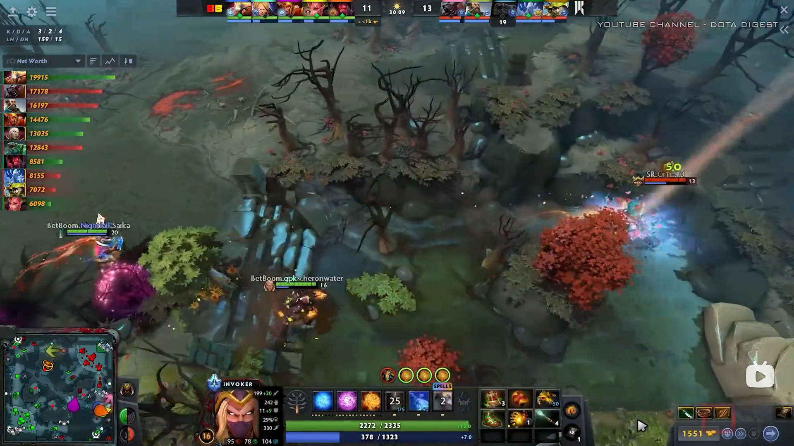

小松鼠

---

右键来控制大招方向

#### 爆栗出击

伤害类型：物理

无视技能免疫：**是**

对地面释放可以种树，利用视野可用于排眼。

#### 野地奇袭

伤害类型：魔法

能否驱散：仅强驱散

眩晕期间视野减低至 **0** 。

先用 `野地奇袭` 在 `爆栗出击` 种树以避免敌人反应快砍树。这套连招的技巧在于 `爆栗出击` 时一定要种的树靠近自己，因为 `野地奇袭` 施法距离比 `爆栗出击` 远，在较远的地方释放 `爆栗出击` 会使英雄向前移动，从而错过时机。注意：`野地奇袭` 释放距离要远，**一定在范围的边缘上**，`爆栗出击` 释放要在 `野地奇袭` **靠近自身的范围圈上**。

01:05 https://www.bilibili.com/video/BV18m4y157De

#### 密林奔走

充能 2 点

移动速度加成，相位碰撞状态，穿行树木效果。

闪避作用范围：275

闪避几率：15% / 20% / 25% / 30%

可以被驱散？比如 `否决吊坠` ？

#### 一箭穿心

破坏被动效果往往能秒掉亚巴顿。

利用大招跨越地形逃生。（图中 Cr1t 失败了）

*颜色取自 DOTA 2 官网*
