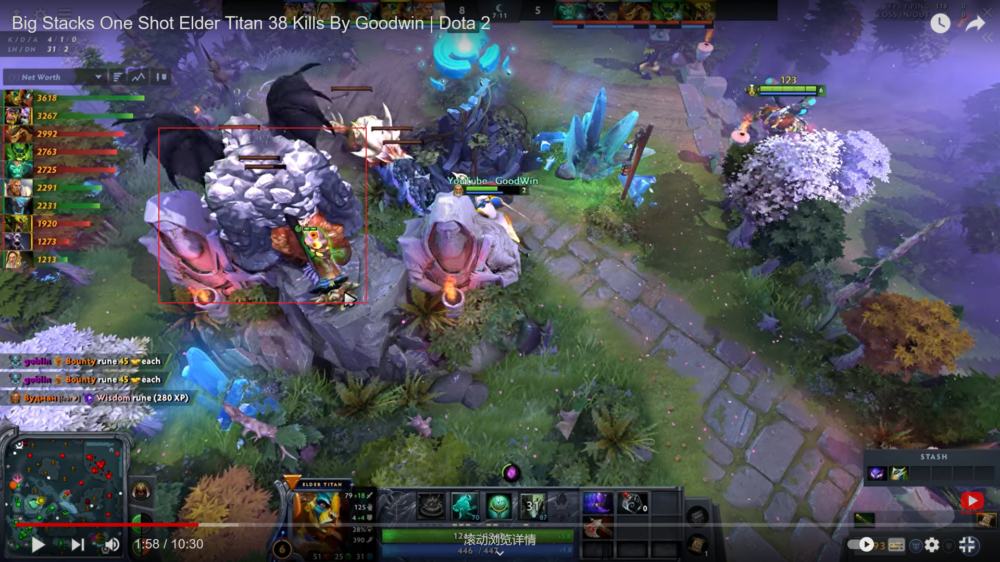

# Keeper of the Light

## 依扎洛，甘道夫

-si 1 2 切换装备位置

致盲之光+减蓝（法力流失）

有些时候波可以拉野（其实是向前位移一段距离）

拉野注意：

1.带闪避的野

2.狂热巨犀，用技能，所以A两下

加蓝（查克拉魔法）的时候脱精气之球

有光法的局，对手就晚上打团、上高，因为光法波白天有治愈效果

致盲之光不能打断白牛C

光法把高地的人弄下来

推推加致盲，使对手进泉水

开雾波

站高地波

军团决斗，先给减魔，再给致盲之光以达到眩晕的效果

海民变成雪球也可以加蓝

光法离敌人远一点放波（启明），使之不易察觉

推推+法力流失

光法波攻击野怪，可拉野

同时，高地防守，a小兵波，能吸引小兵仇恨

波可以同时杀死大小石头人（在残血时）

波不能打断冰女大招

波完后，短暂时间内还有波的视野

剑刃风暴解除法力流失

> 致残(阿托斯)+波+致盲之光

致盲之光以及灵光均可打断土猫拉

致盲打断猛犸拱

致盲打断白牛C

致盲打断小鱼跳

我感觉致盲类似推推，也可以打断白牛C，也可以打断土猫滚，也可以打断猛犸拱

`查克拉魔法` 无法直接作用于邪影芳灵 `暗影之境` ，但是可以通过点击头像来释放；相反，想通过这种方法对 `暗影之境` 下的邪影芳灵释放 `炎阳之缚` 是不行的，点不了敌人的头像。经测试，点头像释放技能只适用于友方。

经测试，`圣洁吊坠` 不能增加 `查克拉魔法` 的魔法恢复量，说明魔法恢复不算治疗？

将野怪推到高台以拉堆叠更多野怪：

#### 英雄配合

光法+炼金刷钱贼快，可召唤炼金，全图打钱

飞机导弹固定对手后，放波以增加精准度
由于飞机导弹眩晕时间长，故我认为这是光法最好的伙伴（ODD vs Liquid）

骷髅王、娜迦克星

光法夜魔不同局

