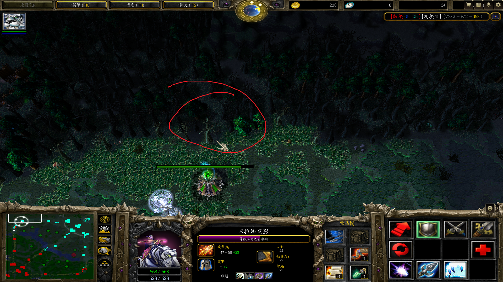

# Mirana Priestess of the Moon

POM	

---

`arrow` 是 `月神之箭`

菊花箭。在跳跃(E)的瞬间点击头像放箭(R)就会扭头在正后方放箭，或者位移点头像。单纯点头像放箭是固定正右的方向。类似的还有牛头的F，屠夫的T

跳跃躲技能。前期可以主跳跃增加逃生能力。

> 跳躲骷髅王锤子 
>
> 可跳过萨尔框
>
> 跳躲船长X，其实不是躲船长X，而是在水前跳走
>
> 跳躲不了小鱼跳

流星范围是650，攻击范围是630，所以在放流星前A人可以提高命中率。

DOTA1 白牛C你，先跳再箭

小鸡泉水挡箭

魔免单位挡箭

远古挡箭

墓碑僵尸挡箭

剑圣开剑刃风暴貌似挡箭

卫士胫甲移除负面效果，如大鱼大

隐身有延迟

箭射中勾兵

箭对兽王鹰无效

流星对开魔免的小狗，有砸落效果，但无伤害

大招躲矮子大

DOTA2 被土猫推的同时可以跳

DOTA2 对付白虎出大吹风，实际上是针对缚灵索

`月神之箭` 对魔方无效

###### 砍树逃生

