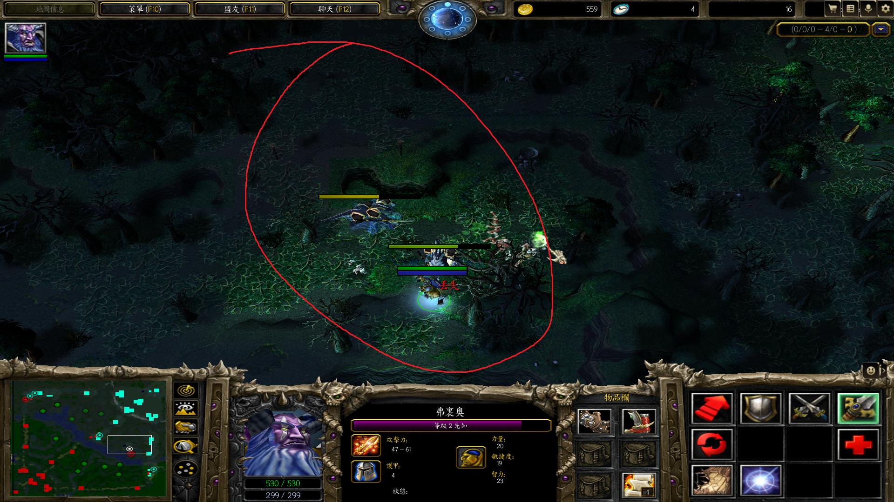

先知	限制

开局开雾到中路插眼杀鸡

先知框兵线

DOTA2 先知框基地，使敌人无法攻击

先知开雾到基地，放信使，插眼，故鸡一出门就死

分身斧躲树/进树（视野），其他分身亦可

先知可在基地高地边缘放眼，信使一出门就死

两个树人刚好A死小鸡

树人吃炸弹人炸弹

框住自己TP，敌人没有视野

放大会显示在地图的位置

别离敌人太近，否则框到一起

克制虚空大招，救队友。要是虚空已经在A队友，可先推推虚空或队友（根据情况，不要把队友推到敌人那边），再框

dota2 框打断 tp?

`发芽` 有视野。

