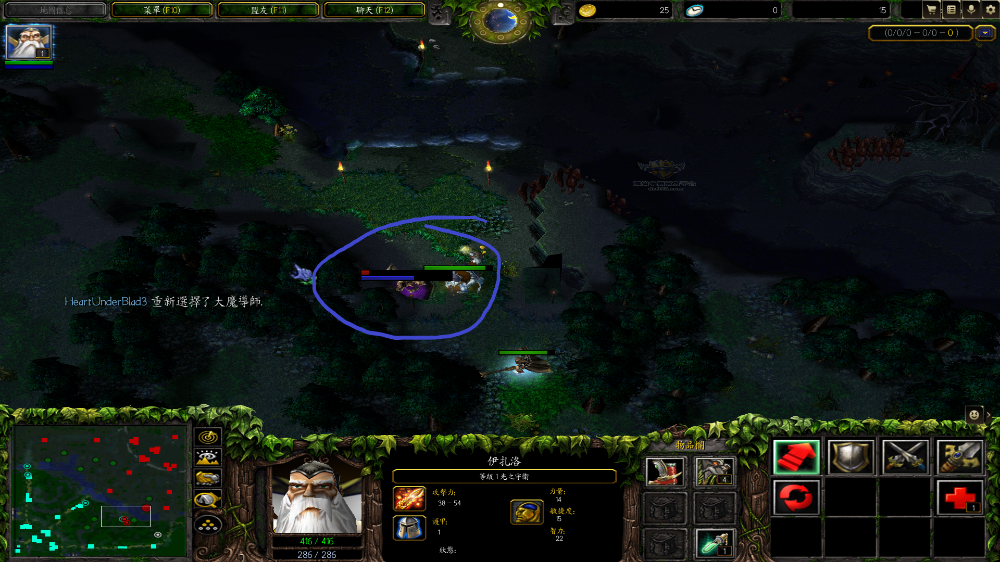
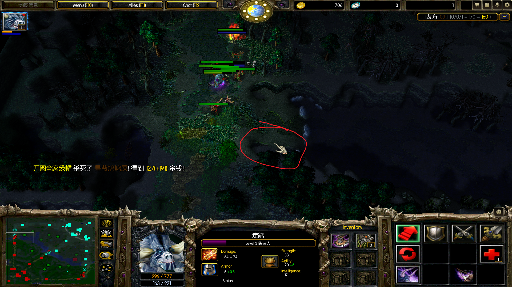

大魔导师

---

#### 隔空取物

被举的单位落地后破坏树木

拉比克 `隔空取物` 可以将单位（不论敌我？）抬进/出 `动能力场`

不能使用 `隔空取物` 举虚空假面（不论敌我） `时空结界` 内的友方/敌方单位。

#### 弱化能流

#### 奥术至尊

配合一个增加施法距离的道具再使用大晕锤可以很轻松打断 BKB 谜团的黑洞。

#### 技能窃取

无视技能免疫

拉比克的C能将白牛C眩晕

C的中途技能时间到了，C也终止

能实现扭头 `两级反转` 吗？

`技能窃取` 不能偷从未使用过技能的英雄的单位。会提示 `不能偷取这个技能` 。典型的有只学被动的露娜。

敌人刚复活时也能被 `技能窃取` 。

`技能窃取` 指向幻象神符、幻影斧产生的幻象时，提示 `不能偷取这个技能` ，难道可以通过这个来分辨哪个是真身？（这是在斧王岛中测试，不知道实战中是否一致）

**拉比克举位置**

**拉比克举位置2**

