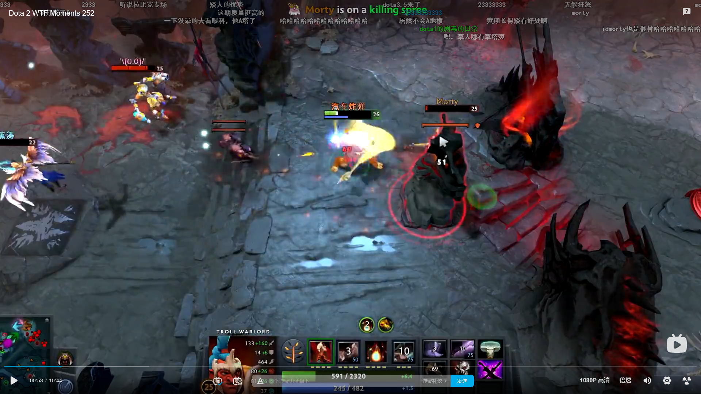

矮子在大海民的时候，若海民在滚，大招取消，若子弹已经射出，海民在滚，则海民不受伤害。

大招可以S掉，在DOTA2显而易见，因此注意DOTA1

放大招时，别人看得见自己

TP可以躲矮子大

大招是魔法攻击，全能套子抵挡伤害，大招有电锤效果（如果出了电锤）

跳刀躲矮子大

大招打断TP

大晕锤对付近战（牛蛙）

打小小出大隐刀+bkb

> 出大炮二技能额外伤害会有加成吗？类似的还有虚空大炮

**矮子的优势**

防御塔比矮子高，敌人在不点地板的情况下，很难A到矮子，除非用魔兽争霸键位ins转换视角

开雾躲矮子大

女王B躲矮子大

