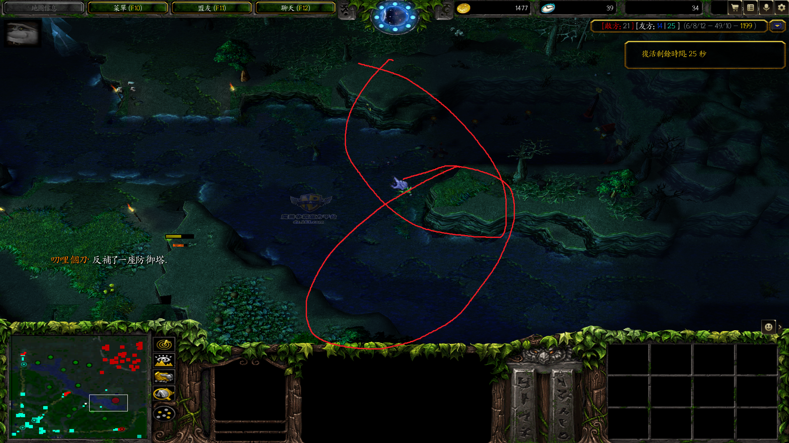

# Earth Spirit 大地之灵

国足  石头猫	土猫 	兔毛	 猫猫	 Earth Spirit		开图的叫 “图猫”

土猫也经常被人误称做 “火猫”

======================================================

沉默不能打断深渊大招

如果自己特别肥，给队友买TP

土猫在船长x快结束的时候滚，可以躲x

DOTA1	**滚+shift推** 无法实现
DOTA2	可以实现

潮汐能净化土猫大招

猴子分身能净化兔毛大招

出绿鞋走得快，更易实现滚到人后推人

不能拉被谜团大的单位

DOTA2 土猫一、三技能有视野

DOTA2 土猫滚可以从很远指向目标，这样无疑增大了滚中的概率；

DOTA2 土猫在滚的时候可以推和拉

DOTA2 对于推拉连招要求更严格，拉的时候要点石头

土猫A杖后，可将自己变为石头，朝向哪个方向，使用一技能，就飞向哪个方向

被血魔放大最好先滚走，再晕，若推开，死亡概率会增大，推开意味着被沉默

对付炸弹人，推上面的野怪下去排雷

土猫 `主滚+骨灰` 能够有强大的续航能力

滚+shift攻击无法实现（中路杀鸡）

有时候一下A不死小鸡

土猫A杖跳刀会是什么感觉

跟屠夫、海民对线，前期可考虑学推，推他们进塔。故前期没有杀鸡，技能留点

死骑罩子可以解土猫大？

土猫推+光法减蓝

逃生的时候先把人推开再滚

在剑圣无敌斩瞬间推开剑圣

推开齐天大圣在他大招时

真眼可看见开雾幽鬼，宙斯大开雾不能躲

#### 土猫三角

###### 土猫一技能拉野

### 英雄配合

土猫推中帕克大招的人，以造成眩晕效果

土猫拉C中的白牛，可使白牛C完后回到土猫身边

